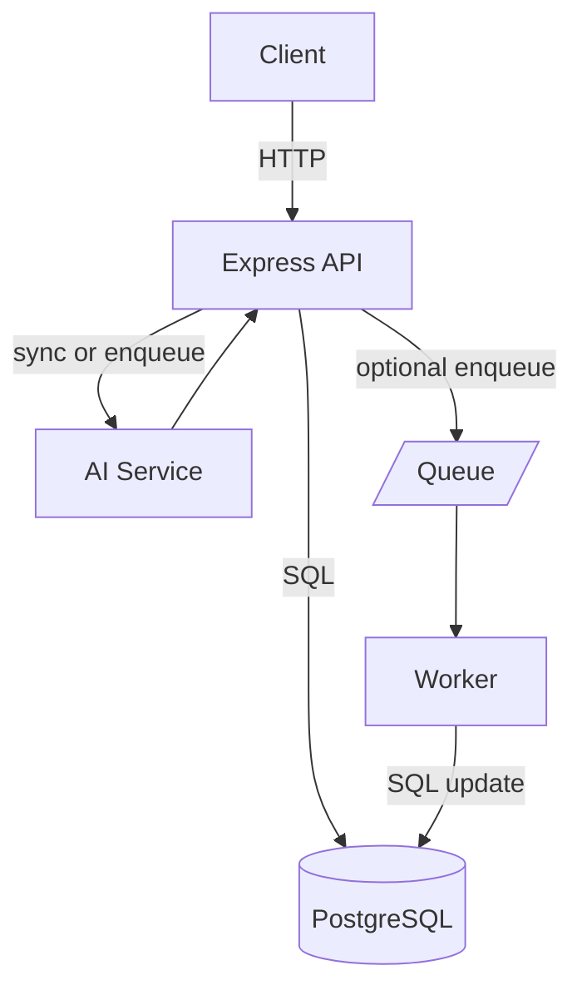

# Customer Support Tickets Management (Backend)

Backend service with AI-based automatic classification of tickets.

## Run
1. Copy `.env.example` to `.env` and set values.
2. Install deps: `npm install`
3. Start dev server: `npm run dev`

## Env
- `DB_URL` PostgreSQL connection string
- `OPENAI_API_KEY` OpenAI API key
- `PORT` server port (default 3000)

## Endpoints
- `POST /tickets`
- `GET /tickets/:id`
- `GET /tickets`
- `POST /users`
- `GET /users/:id`
- `GET /users`

---

## Architecture

- **API Layer (`src/server.ts`, `src/app.ts` if present)**
  - Express.js routes for `POST /tickets`, `GET /tickets`, `GET /tickets/:id`.
  - Validation via Zod in `src/modules/tickets/ticket.validator.ts` (query/body schemas).
  - Central error handling returns consistent JSON on 400/404.

- **Service Layer (`src/modules/tickets/ticket.service.ts`)**
  - Orchestrates ticket creation and AI classification.
  - Supports two modes:
    - Synchronous classification (default).
    - Optional async queue (when `USE_QUEUE=true`) by enqueuing a job and returning immediately.

- **Repository Layer (`src/modules/tickets/ticket.repository.ts`)**
  - All DB access is centralized here.
  - Implements filtering and pagination using validated params.

- **AI Service (`src/services/ai.service.ts`)**
  - Calls OpenAI, validates the structured result, and returns `{ category, priority, confidence, fallback }`.
  - Robust error handling with a safe fallback to avoid failing requests.

- **Queue (optional) (`src/queue/index.ts`, `src/workers/classifier.worker.ts`)**
  - When enabled, background worker consumes `classify` jobs and updates the ticket.
  - Powered by BullMQ (requires Redis). Disabled by default.

- **OpenAPI (`openapi.yaml`)**
  - Complete schema and examples for requests/responses and error cases.

- **CI**
  - GitHub Actions workflow in `.github/workflows/ci.yml` spins up Postgres and runs tests.



## Database

- **Choice: PostgreSQL**
  - ACID, strong consistency, mature tooling, powerful querying and indexing.

- **Schema** (see `sql/schema.sql`)
  - Enums: `category_enum (billing|technical|general)`, `priority_enum (low|medium|high)`, `status_enum (open|closed)`, `ai_status_enum (pending|done|fallback)`
  - Table: `users`
    - `id SERIAL PRIMARY KEY`
    - `name TEXT NOT NULL`
    - `email TEXT NOT NULL UNIQUE`
    - `created_at TIMESTAMPTZ DEFAULT now()`
  - Table: `tickets`
    - `id SERIAL PRIMARY KEY`
    - `title TEXT NOT NULL`
    - `description TEXT NOT NULL`
    - `category category_enum`
    - `priority priority_enum`
    - `ai_confidence FLOAT`
    - `status status_enum DEFAULT 'open'`
    - `ai_status ai_status_enum DEFAULT 'pending'`
    - `created_by INTEGER REFERENCES users(id) ON DELETE SET NULL`
    - `created_at TIMESTAMPTZ DEFAULT now()`

- **Indexes & queries**
  - Primary key on `id`.
  - Filter by `category`, `priority`, `status` with WHERE clauses.
  - Pagination: `ORDER BY created_at DESC LIMIT $n OFFSET $m`.

### Relationships

- **User has many Tickets**
  - `tickets.created_by -> users.id` (nullable). If a user is deleted, `created_by` becomes `NULL` (ON DELETE SET NULL).
  - If a user named `admin` exists, all ticket creations default to `created_by = admin.id` (the request `createdBy` field is ignored).
  - If no `admin` user exists, the request may provide `createdBy` to set the creator; otherwise `created_by` is `NULL`.

## AI Integration

- **Approach**
  - Uses OpenAI (model configurable via `AI_MODEL`, defaults like `gpt-4o-mini`).
  - Prompt guides model to output strict JSON, parsed and validated with Zod.

- **Synchronous mode (default)**
  - `POST /tickets` inserts ticket with `ai_status=pending`.
  - Immediately calls AI; on success updates `category/priority/ai_confidence` and sets `ai_status=done`.
  - On failure, logs diagnostics and returns a safe fallback (`{ category: general, priority: medium, confidence: 0, fallback: true }`) with `ai_status=fallback`.

- **Asynchronous mode (optional)**
  - Set `USE_QUEUE=true` and provide `REDIS_URL`.
  - API enqueues `{ id, title, description }` and returns 201 quickly.
  - `src/workers/classifier.worker.ts` consumes jobs, calls AI, and updates the ticket.

- **Resilience**
  - Timeouts (`AI_TIMEOUT_MS`) and defensive parsing to avoid request failures.
  - Queue jobs configured with retries and exponential backoff.

## Assumptions & Trade-offs

- **Assumptions**
  - Moderate traffic; a single Postgres instance suffices for evaluation.
  - Categories (`billing/technical/general`) and priorities (`low/medium/high`) cover most cases.
  - Immediate consistency preferred over eventual for listing and retrieval.

- **Trade-offs**
  - Synchronous AI is simpler but can add latency. Made async optional via queue to keep baseline easy to run without Redis.
  - Using PostgreSQL ENUM types for stronger data integrity on categorical fields.
  - Pagination via `limit/offset` for simplicity; keyset pagination could be added later for very large datasets.
  - Minimal external deps by default; queue (BullMQ) only required when `USE_QUEUE=true`.

## Docs & Testing

- **OpenAPI**: `openapi.yaml` serves Swagger UI at `/docs` and JSON at `/docs.json` (see server wiring).
- **Tests**: Jest + Supertest in `src/__tests__/tickets.test.ts` cover creation, validation, pagination, and error cases.

## Async queue (Redis)

Ticket classification can be processed asynchronously using a Redis-backed queue. This is optional and disabled by default.

- **Enable** by setting in `.env`:
  ```env
  USE_QUEUE=true
  REDIS_URL=redis://localhost:6379
  ```

- **Run with Docker (no local install):**
  ```bash
  docker run -d --name redis -p 6379:6379 redis:7
  ```

- **Run with local Redis (macOS/Homebrew):**
  ```bash
  brew install redis
  brew services start redis
  # Verify
  redis-cli ping   # PONG
  ```

- **Start the app and worker:**
  - API: `npm run dev`
  - Worker: `npm run worker` (runs `src/workers/classifier.worker.ts`)

- **What to expect:**
  - `POST /tickets` immediately returns 201 with `ai_status: "pending"`.
  - The worker consumes jobs from the `classify` queue, calls the AI, and updates the ticket (`ai_status: "done"` or `"fallback"`).

- **Disable async mode:**
  - Set `USE_QUEUE=false` (default). In this mode classification runs synchronously in the request path and Redis is not required.


## Observability & Ops

- **Structured logging**
  - File: `src/utils/logger.ts`
  - Usage: JSON logs with `level`, `msg`, `time`, and optional metadata.
  - Integrated in `src/server.ts` (startup log) and `src/services/ai.service.ts` (AI error logs).
  - Example output:
    ```json
    {"level":"info","msg":"Server running","time":"2026-02-02T07:00:00.000Z","port":3000}
    ```

- **Logging choice rationale**
  - This project is an assessment and will not integrate with Elastic/ELK or other centralized logging stacks.
  - A tiny, dependency-free JSON logger is sufficient: logs are written to stdout and can be captured by Docker/K8s or CI.
  - We don't need advanced features like multi-transports, file rotation, or pretty dev formatting that libraries like Winston/Pino provide.
  - If requirements grow in the future, we can swap in Pino (performance-focused) or Winston (feature-rich) with minimal code changes.

- **Rate limiting**
  - File: `src/middleware/rateLimiter.ts` (uses `express-rate-limit`).
  - Applied globally in `src/app.ts` before routes.
  - Defaults (can be tuned via env):
    - `RATE_LIMIT_WINDOW_MS=900000` (15 minutes)
    - `RATE_LIMIT_MAX_REQUESTS=100` (per IP per window)
  - Automatically sends standard `RateLimit-*` headers when enabled.

- **AI configuration via env**
  - File: `src/services/ai.service.ts`
  - Config:
    - `AI_MODEL` (default: `gpt-4o-mini`)
    - `AI_TIMEOUT_MS` (default: `8000`)
  - Set these in `.env` to adjust model selection and request timeout.

